# CI-CD pipeline using CodeCommit-Build-Deploy in AWS

---

---
### TABLE OF CONTENTS
- Introduction
What is AWS CodeCommit?

* Step 1: Create an AWS CodeCommit repository.

  Write buildspec.yml file for code build & store artifacts in s3 Bucket.Add Script for installing & starting NGINX Webserver
* Write appspec.yml file for codedeploy
* What is AWS CodeBuild?
* Step 2: Create a CodeBuild project
* What is CodeDeploy?
* What is AWS CodePipeline?
* Benefits:
* Step 3: Create a CodeDeploy application and deployment group
* Step 4: Create a CodePipeline
---
## Prerequisite

* Before we begin with the Project, we need to make sure we have the following prerequisites installed And Configured:

- AWS Account with Administrator policy. You Can also give Specific permission to the user. Make sure you Generate HTTPS Git credentials for AWS CodeCommit for the user. This can be used to push code from a local source to a CodeCommit repository.

- You can do this by going to IAM \=> Users \=> Security credentials => HTTPS Git credentials for AWS CodeCommit => Generate credentials.
EC2 Instance ( AMI- Ubuntu, Type- t2.micro, Region: us-east-1 )

- You can Install CodeDeploy Agent by running the below script while creating an ec2 instance or after that. and these steps are for Ubuntu AMI.

``` Code-deploy agent Script
#!/bin/bash
sudo apt-get update
sudo apt-get install ruby
sudo apt-get install wget
cd /home/ubuntu
wget https://aws-codedeploy-ca-central-1.s3.ca-central-1.amazonaws.com/latest/install
chmod +x ./install
sudo ./install auto
```
- Check code-deploy agent status command.
```
sudo service codedeploy-agent status
```
- Start service & restart service command.
```
sudo service codedeploy-agent start

sudo service codedeploy-agent restart
```
### Full set of userdata to launch an instance.

! **use this user it in Ubuntu instance only**

```userdata
#!/bin/bash
sudo su -
apt update -y
apt install nginx -y
systemctl start ngnix
apt-get install ruby -y
apt-get install wget -y
cd /home/ubuntu
wget https://aws-codedeploy-ca-central-1.s3.ca-central-1.amazonaws.com/latest/install
chmod +x ./install
sudo ./install auto
sudo service codedeploy-agent start
```
----

### Launch an instance using about script.
- follow below 10 steps to launch an instance


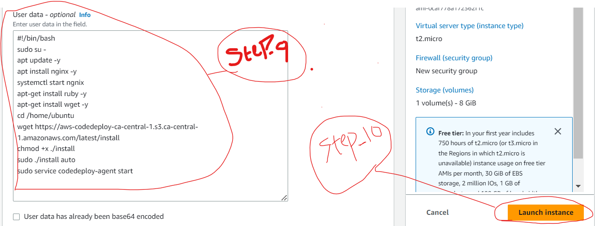
---
- Once instance is up and running connect to the instance and check the Nginx and Code-deploy agent status.
---

---
***_Both the services should be up and running_***

- By this our instance setup is done.

### IAM Roles creation

**_Create a policy using below 7 steps_**

* You need to create two roles one with updating the Trust policy and other one without updating it.

### create role 1- for instance attaching


_Same way create other for Code-deploy setup_

### Create role 2- for code-deploy setup - needs Trust policy edited.


- Open the created role and add the Trust relationships.
  - This is required for the code deploy deployment group creation.
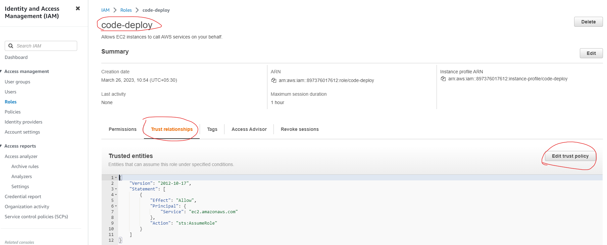
---
In the above step 'EDIT TRUST POLICY' and add the below code in there.
```
{
	"Version": "2012-10-17",
	"Statement": [
		{
			"Effect": "Allow",
			"Principal": {
				"Service": "codedeploy.amazonaws.com"
			},
			"Action": "sts:AssumeRole"
		}
	]
}
```

## IAM role-1 which you have created to be updated with EC2 agent.

- Next attach this Role to our created EC2 instance.
---

---
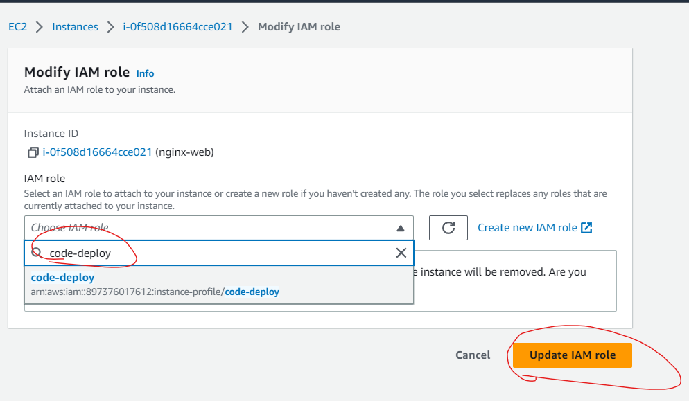
---
**(Note: Restart codedeploy-agent service After attaching the service role policy to the EC2 instance)**
- Connect to the insance and then restart the codedeploy-agent.

- Next update the instance tags if instance is not having it follow below snippet.
- This tags are required to identify the instance by codedeploy.
---

---

- Next Create an S3 Bucket for storing your build artifacts.
  * S3 Bucket creation.
   * S3 bucket name should be unique so use different bucket name like example: nginx-artifacts-todaydaysdate (nginx-artifacts-26032023)

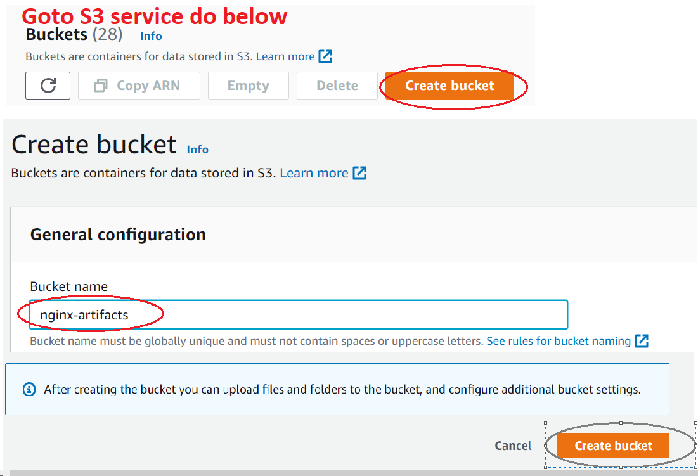

**_Great🎊🎉😍😍😍 - You're all set for the project. Your Ec2 Instance is now prepared for deploying the application_**

## Code Commit

### What is AWS CodeCommit?
AWS CodeCommit is a version control service hosted by Amazon Web Services that you can use to privately store and manage assets (such as documents, source code, and binary files) in the cloud.

#### Below are the steps to create an AWS Code pipeline using all the native AWS tools:

- Step 1: Create an AWS CodeCommit repository
Go to the AWS CodeCommit console and click "Create repository".

- Give your repository a name and description, and choose whether to make it public or private.

- Click "Create" to create the repository.

- Once the repository is created, click the "Clone URL" button to get the URL for cloning the repository to your local machine.

Clone the repository to your local machine using Git.

Create a sample index.html, buildspec.yml, appspec file & scripts to run during codedeploy.

Create your repo inside Code Commit.


---
Sample git repo code: 
[Refer here](https://github.com/jagadeshsure/Mini-project)

- Once your code ready lets proceed creating Code Build.

## Code Build
### What is AWS CodeBuild?

AWS CodeBuild is a fully managed build service in the cloud. CodeBuild compiles your source code, runs unit tests, and produces artifacts that are ready to deploy. CodeBuild eliminates the need to provision, manage, and scale your own build servers
#### How code-build works ?
- Code build works based on the instructions mentioned in the Build spec file. 'buildspec.yml'
- Let us understand the code-build file which we have prepared as part of our project.
---
``` code
version: 0.2

phases:
  install:
    commands:
      - echo Installing NGINX
      - sudo apt-get update
      - sudo apt-get install nginx -y
  build:
    commands:
      - echo Build started on `date`
      - cp index.html /var/www/html/
  post_build:
    commands:
      - echo Configuring NGINX

artifacts:
  files:
    - '**/*'
```
---
- This is a build specification file written in YAML format, which is used by the AWS CodeBuild service to automate the build, test, and deployment process for your application.

- The version: 0.2 at the top specifies the version of the buildspec file format being used.

- The phases section contains three phases: install, build, and post_build. These phases are executed in order during the build process:

- The install phase installs the NGINX web server on the build server by running the specified commands. First, it echoes a message indicating that NGINX is being installed. Then, it updates the package list and installs NGINX using the apt-get package manager with the -y flag, which answers "yes" to any prompts.

- The build phase starts by echoing a message indicating that the build has started and prints the current date. It then copies the index.html file to the /var/www/html/ directory on the build server, which is the default location for serving web content for NGINX.

- The post_build phase runs after the build phase is completed. It simply echoes a message indicating that NGINX is being configured.

- The artifacts section specifies the files that should be included in the output artifact produced by the build process. In this case, the files section specifies that all files and directories in the build output should be included in the artifact. The **/* pattern matches any file or directory recursively in the build output directory.
----
----
## Lets start implementing Code build.
- Go to Code build section -> build projects and create a project as shown below.
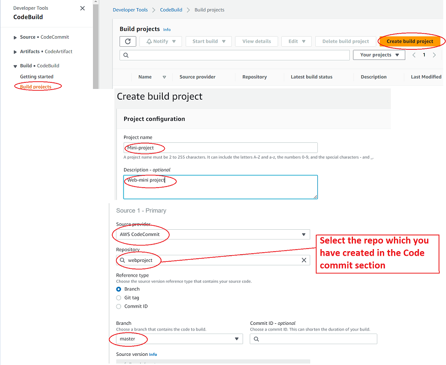
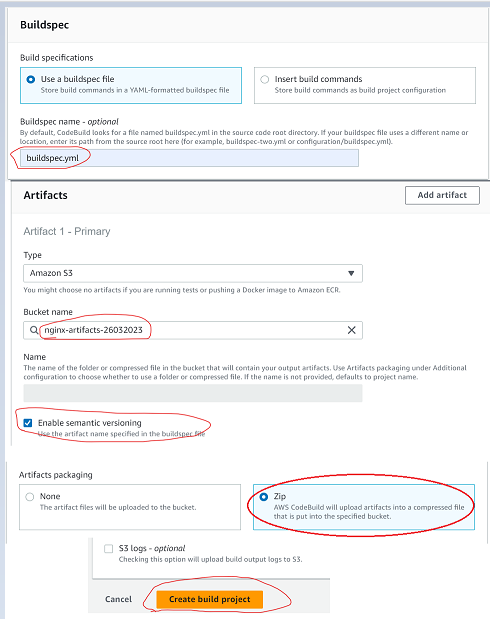
---

- You can follow the above snippets or below steps to create the Code build.
#### Create a CodeBuild project-

- Go to the AWS CodeBuild console and click "Create build project".

- Give your build project a name and description.

- In the "Source" section, choose "AWS CodeCommit" as the source provider and select the repository you created in Step 1. And select the Branch of your repository.

- In the "Environment" section, choose a build environment that meets your requirements, such as "Ubuntu". Choose runtime as "Standard:6.0"

- In the "Buildspec" section, Choose "Use a buildspec file".

- In the "Artifacts" section, choose "Amazon S3" as the type and specify the S3 bucket and key prefix where build artifacts should be stored.

- Select the "Artifacts packaging" as a "Zip".

- In the Logs Section, Untick the Checkbox of "CloudWatch logs"

- Click "Create build project" to create the CodeBuild project.

- Click on Start Build. Once all the Stages are finished, the Build File will be generated in the S3 Bucket.
---
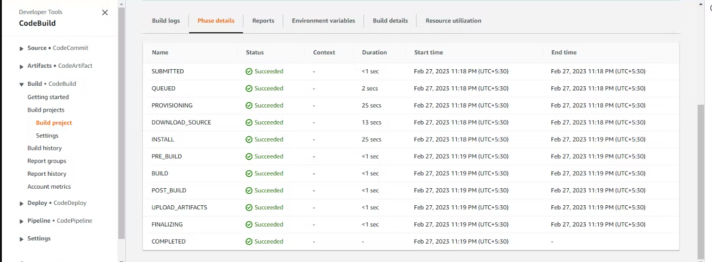

---
## Code Deploy
### What is CodeDeploy?
- CodeDeploy is a deployment service that automates application deployments to Amazon EC2 instances, on-premises instances, serverless Lambda functions, or Amazon ECS services.

- You can deploy a nearly unlimited variety of application content, including:

  - Code

  - Serverless AWS Lambda functions

  - Web and configuration files

  - Executables

  - Packages

Scripts

Multimedia files

CodeDeploy can deploy application content that runs on a server and is stored in Amazon S3 buckets, GitHub repositories, or Bitbucket repositories. CodeDeploy can also deploy a serverless Lambda function. You do not need to make changes to your existing code before you can use CodeDeploy.

---
---
### Steps to create the Application and deployment group.
- Create a CodeDeploy application and deployment group
Go to the AWS CodeDeploy console and click "Create application".

- Give your application a name, Select "Compute platform" As "EC2/On-premises" and click "Create application".

- Once the application is created, click "Create deployment group" to create a new deployment group for the application.

- Give your deployment group a name, Select the service role, and choose the Amazon EC2 instances where we will deploy the application

- In "Environment configuration" Select "Amazon EC2 instances" and then select "key" as a "Name" & "Value" as "InstanceName". (Note:- Select the instance that you created in the prerequisites section and which has already installed CodeDeploy Agent)

- Select "Never" in "Install AWS CodeDeploy Agent" & "Unselect Enable load balancing"

- Click "Create deployment group" to create the deployment group.

---
**You can also follow the snippets to create the same**
#### Creating Application.

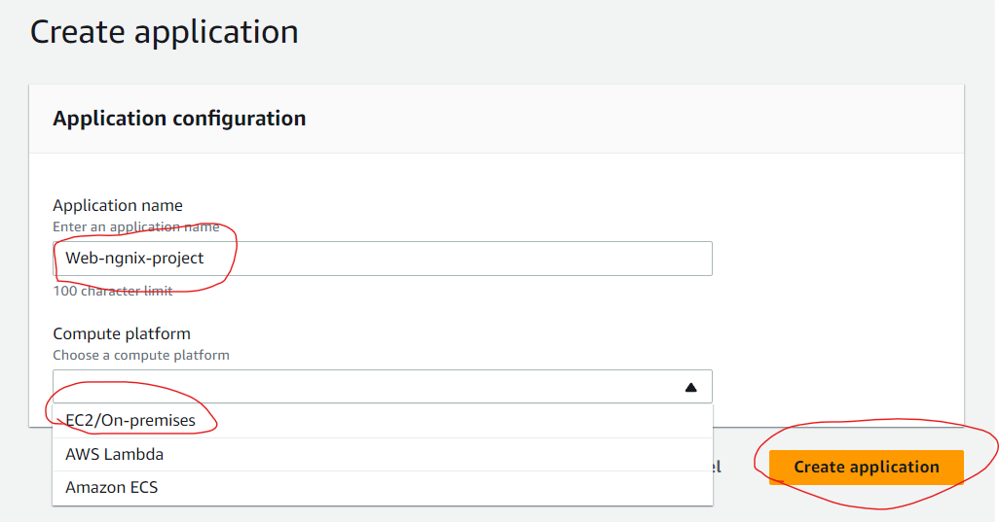
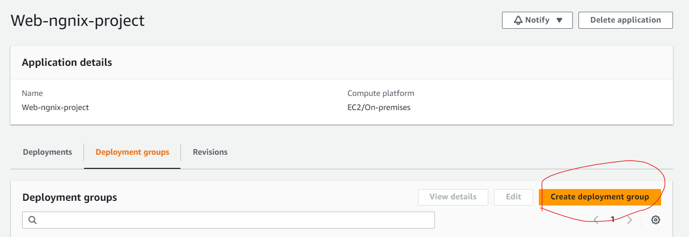
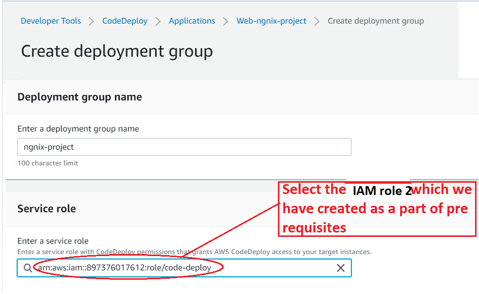
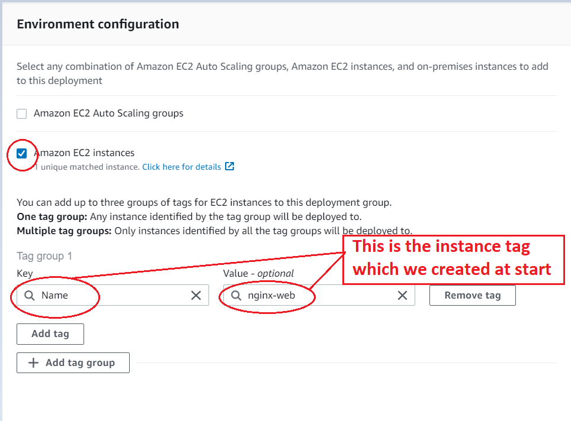
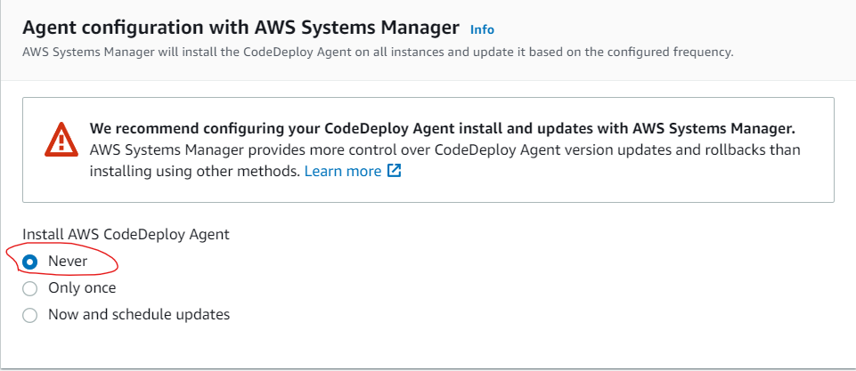
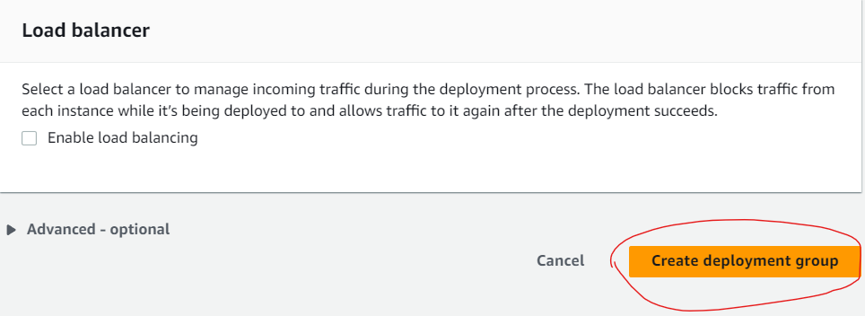
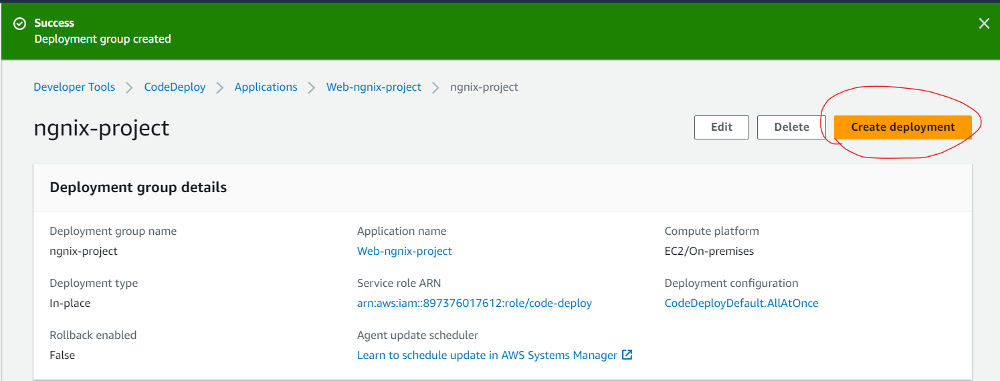
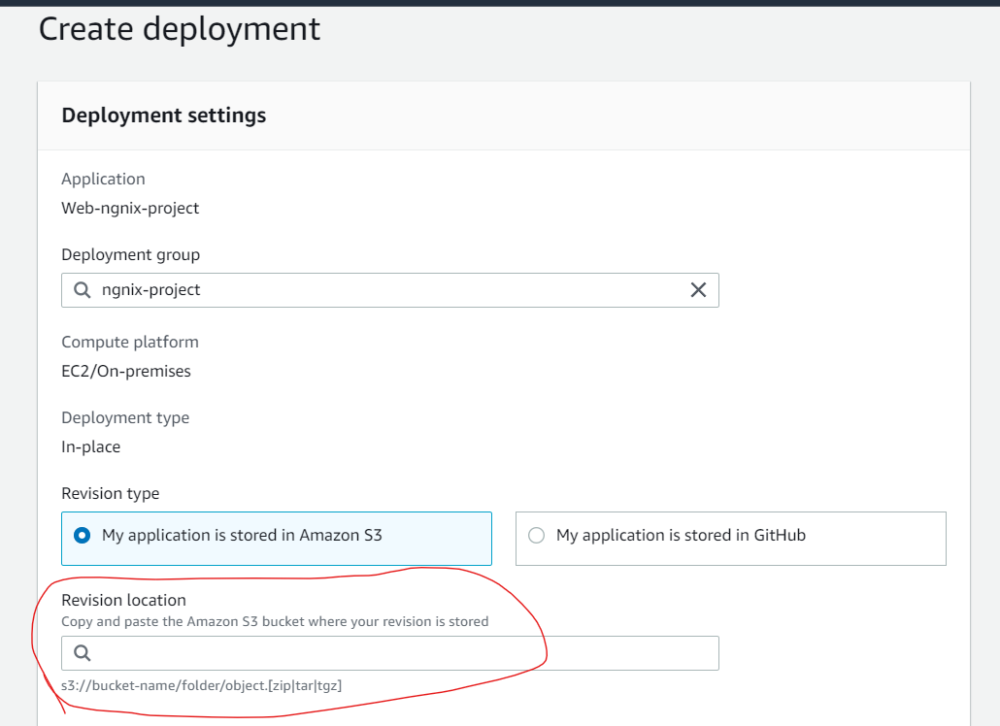

- _We have to get the revision from S3 which we have created at starting as a part of prerequisites_

- GO TO S3 SERVICE -> S3 BUCKET -> COPY S3 URI


- Go inside your bucket to copy S3 URI
- S3 URI syntax: S3://S3bucket/object.zip
- Before this step you should have your code build run. that will push the artifactory to S3.

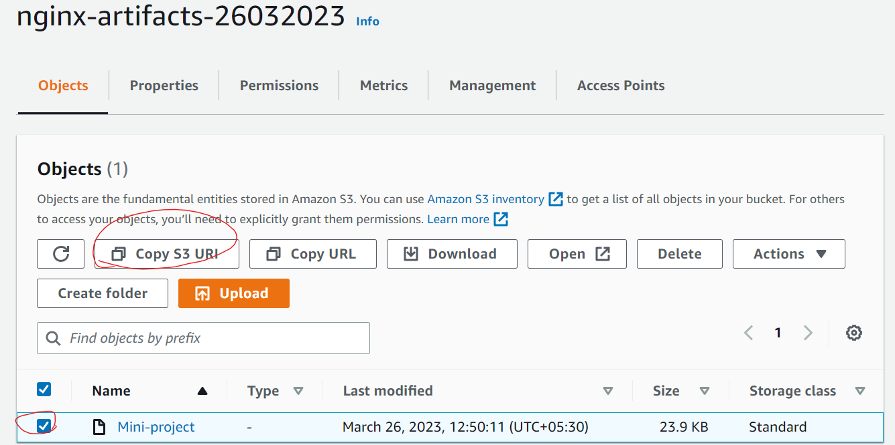

- Revision location update back in codedeploy section.


Then Deployment will start and it will get success.

## _**Congratulations! 😍 😎 Your application is now running on an EC2 IP address. But, wait, it's not over yet. 😂 😂 😂 We have to automate this deployment through AWS CodePipeline.**_

---
---
# Code pipeline

### Create a CodePipeline

#### Follow the below steps to create pipeline.

- Go to the AWS CodePipeline console and click "Create pipeline".

- Give your pipeline a name and click "Next".

- In the "Source" section, choose "AWS CodeCommit" as the source provider and select the repository & branch you created in Step 1.

- Select "Change detection options" as "AWS CodePipeline" and then "Next".

- In the "Build" section, choose "AWS CodeBuild" as the build provider and select the CodeBuild project you created in Step 2 and click "Next".

- In the "Deploy" section, choose "AWS CodeDeploy" as the deployment provider and select the application and deployment that you created in Step 3 and click "Next".

- Review once & click "Create pipeline". It will take time to complete all the steps.

## Follow Snippets to create the same if you are not intrested in reading steps:
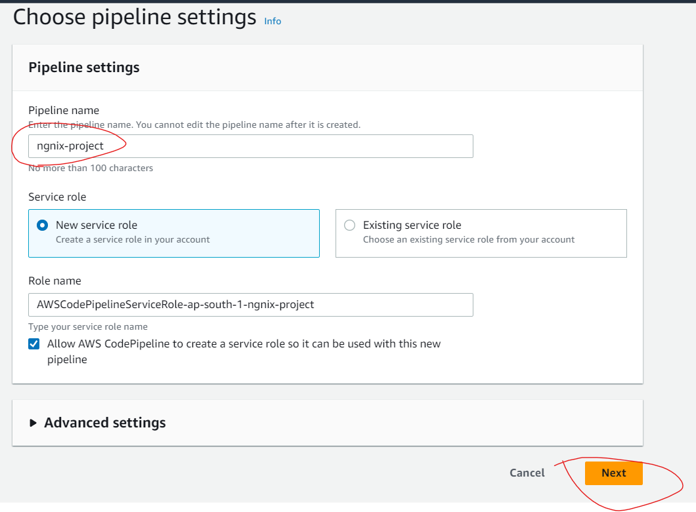

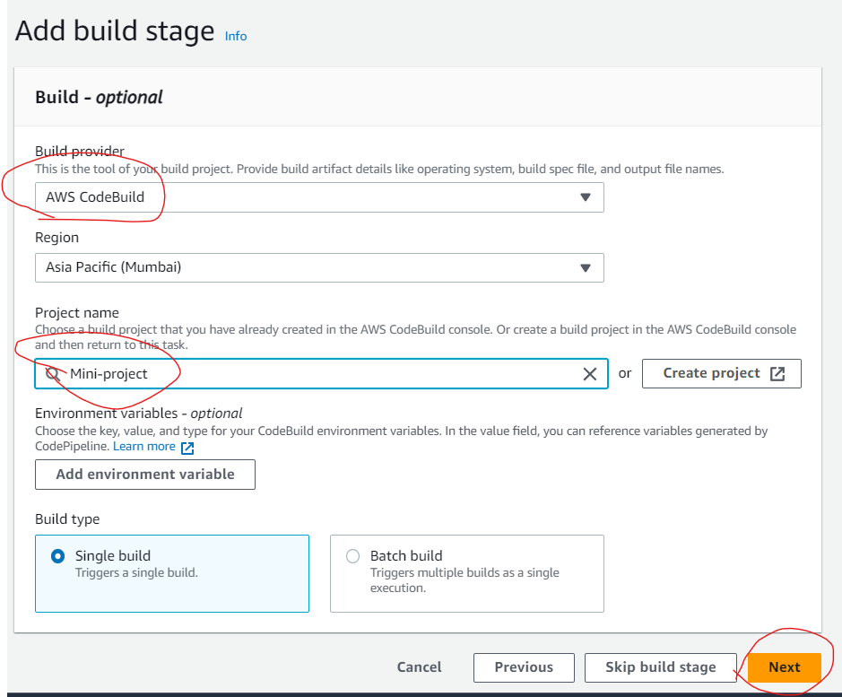
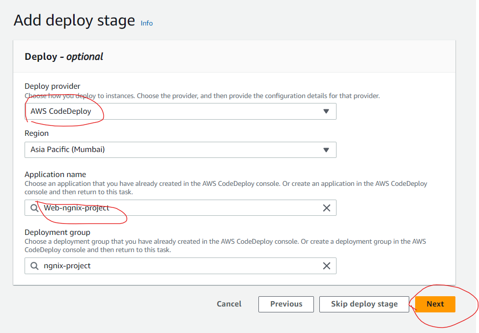

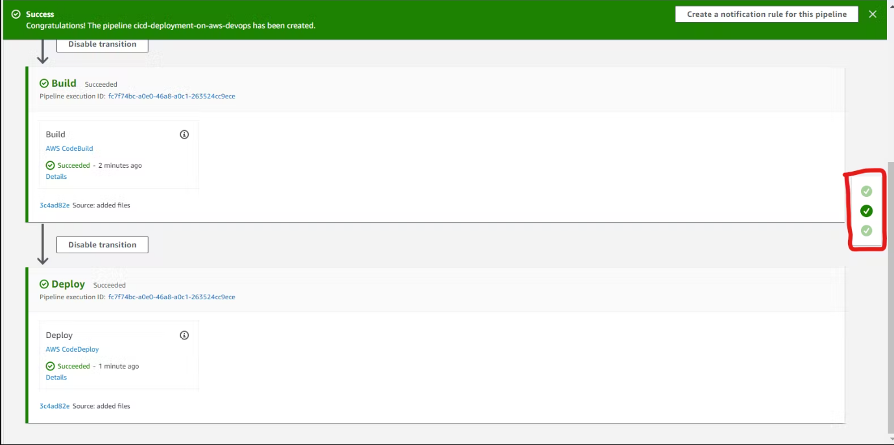

You can now take the instace IP and hit the IP in the browser to see the result.

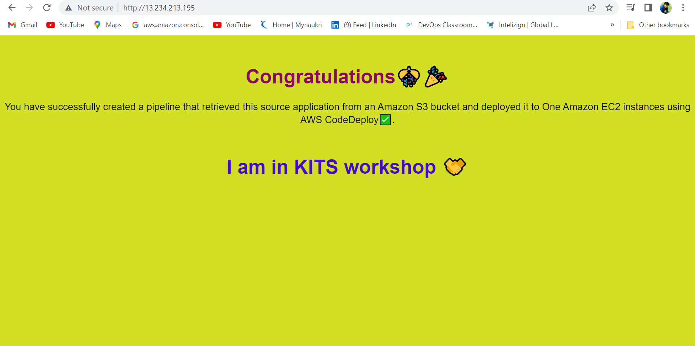

## _Congratulations🎊 Your application is now running on an EC2 IP address We have automated this deployment through AWS Code Pipeline with AWS Code Commit, Code Build & Code Deploy._


---
---
---

### You have the ability to modify your HTML page and upload it to codecommit. Once uploaded, the pipeline will initiate automatically and deploy the updated application. You have the option to set up an alarm for this specific pipeline and receive a notification when it is activated.


---


<font color='green'>Thanks for reading to the end; I hope you gained some knowledge. ❤️🙌</font>


Best Regards,

 😉  <font color='orange'>_Venkatesh Pathuri_</font>


